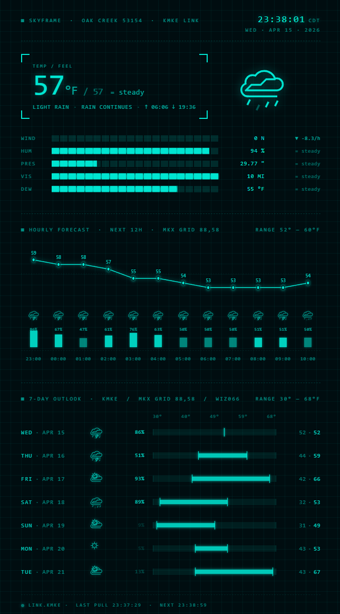

# SkyFrame

Local ad-free weather dashboard for ZIP 53154 (Oak Creek, WI). Single-purpose utility that pulls directly from NOAA/NWS and renders the data as a cyan-on-black HUD-style dashboard in your browser.



See [PROJECT_SPEC.md](PROJECT_SPEC.md) for product context, [WEATHER_PROVIDER_RESEARCH.md](WEATHER_PROVIDER_RESEARCH.md) for the NWS evaluation, and [docs/superpowers/specs/2026-04-15-skyframe-design.md](docs/superpowers/specs/2026-04-15-skyframe-design.md) for the implementation design.

## What this is (and isn't)

- **NOAA/NWS only.** No API keys, no third-party weather providers, no accounts.
- **Single-user, localhost-only.** No auth, no multi-tenancy, no cloud deploy story.
- **No ads, no analytics, no telemetry.** No data leaves your machine beyond the NWS requests themselves.
- **Hardcoded to one location** (Oak Creek, WI / ZIP 53154) in v0.1. If you want to run it for a different area, see [Adapting to your location](#adapting-to-your-location-v01--manual) below.

## Setup

Requires Node.js 20+ and npm.

```bash
git clone <repo>
cd SkyFrame
npm install
```

## Run

**Production (what you want for daily use):**

```bash
npm run build    # Compiles the React client into dist/client
npm run server   # Starts Fastify on http://localhost:3000
```

Open http://localhost:3000 in your browser.

**Development (with hot reload):**

```bash
npm run server   # Terminal 1: Fastify backend on :3000
npm run dev      # Terminal 2: Vite dev server on :5173 with /api proxy
```

Open http://localhost:5173 — Vite handles the frontend with HMR, /api calls proxy to the backend.

## Tests

```bash
npm test           # Run once
npm run test:watch # Watch mode
npm run typecheck  # TypeScript check without building
```

## Adapting to your location (v0.1 — manual)

v0.1 is hardcoded to Oak Creek, WI. To run it for your own area you have to edit four files by hand. v1.1 will replace this with runtime configuration — treat the flow below as a temporary stopgap.

You will need: a lat/lon for your location (e.g. from Google Maps — right-click → copy coordinates) and a contact email.

### Step 1 — Change the User-Agent email (required)

NWS requires every request to identify the app and a contact email. Requests with a missing or generic User-Agent can be rate-limited or rejected outright.

Edit [server/config.ts](server/config.ts) line 17:

```ts
userAgent: 'SkyFrame/0.1 (ken.culver@gmail.com)',
```

Replace `ken.culver@gmail.com` with your own email. The `SkyFrame/0.1` prefix is fine to keep or change.

### Step 2 — Look up your NWS grid and nearby stations

NWS doesn't expose weather by lat/lon directly — you resolve lat/lon to a grid point once, then use grid-based endpoints. Run:

```bash
curl -H "User-Agent: yourapp/0.1 (you@example.com)" \
  "https://api.weather.gov/points/{lat},{lon}"
```

Replace `{lat},{lon}` with your coordinates (e.g. `42.8939,-87.9261`). **Include the User-Agent header** — without it, NWS will reject the request.

From the JSON response, note:
- `properties.gridId` → this is the forecast office (e.g. `MKX`)
- `properties.gridX`, `properties.gridY` → grid coordinates
- `properties.timeZone` → e.g. `America/Chicago`
- `properties.forecastZone` → ends in an ID like `WIZ066`

Then fetch the nearby station list from the URL in `properties.observationStations`:

```bash
curl -H "User-Agent: yourapp/0.1 (you@example.com)" \
  "https://api.weather.gov/gridpoints/{gridId}/{gridX},{gridY}/stations"
```

Pick two stations: a **primary** (first-class ASOS site, typically at an airport, within ~15 km) and a **fallback** (second-closest ASOS, used when the primary's latest observation is stale or has null core fields). Note their four-letter IDs (e.g. `KMKE`, `KRAC`).

### Step 3 — Update `server/config.ts`

Edit the `location`, `nws`, and `stations` blocks in [server/config.ts](server/config.ts):

```ts
location: {
  lat: <your lat>,
  lon: <your lon>,
  zip: '<your ZIP>',
  cityState: '<City, ST>',
},
nws: {
  forecastOffice: '<gridId>',
  gridX: <gridX>,
  gridY: <gridY>,
  timezone: '<timeZone>',
  forecastZone: '<forecastZone id>',
  userAgent: 'SkyFrame/0.1 (you@example.com)',  // already done in Step 1
  baseUrl: 'https://api.weather.gov',
},
stations: {
  primary: '<primary station ID>',
  fallback: '<fallback station ID>',
  stalenessMinutes: 90,
},
```

Leave the `cache`, `trendThresholds`, and `server` blocks alone.

### Step 4 — Update the hardcoded display strings in the client

v0.1 has three display strings hardcoded in the React components. Update them to match your location:

- [client/components/TopBar.tsx:43](client/components/TopBar.tsx#L43) — replace `OAK CREEK 53154 · KMKE LINK` with your city, ZIP, and primary station
- [client/components/HourlyPanel.tsx:49](client/components/HourlyPanel.tsx#L49) — replace `MKX GRID 88,58` with your `{forecastOffice} GRID {gridX},{gridY}`
- [client/components/OutlookPanel.tsx:36](client/components/OutlookPanel.tsx#L36) — replace `KMKE / MKX GRID 88,58 / WIZ066` with your primary station, grid, and forecast zone

Rebuild and run (`npm run build && npm run server`) and you should see your area's weather.

> **Note:** v1.1 will move all of this into a single config file or env vars and remove the hardcoded strings from the client. This manual flow only exists so v0.1 is usable by others before v1.1 lands.

## Structure

- `shared/types.ts` — WeatherResponse type contract, imported by both server and client
- `server/` — Fastify backend, NWS proxy, in-memory cache
- `client/` — React + Vite frontend with the three HUD views
- `docs/mockups/` — static HTML mockups (source of truth for visual design)
- `docs/superpowers/specs/` — design docs
- `docs/superpowers/plans/` — implementation plans

## Why a backend at all?

NWS requires a `User-Agent` header identifying your app and contact email. Browsers forbid `fetch()` from setting `User-Agent` (it's on the forbidden headers list), so a pure client-side SkyFrame couldn't comply with NWS terms. The Fastify backend acts as a thin local proxy: browser calls `/api/weather`, the server calls NWS with the required headers, normalizes the response, and returns a single clean JSON shape.
