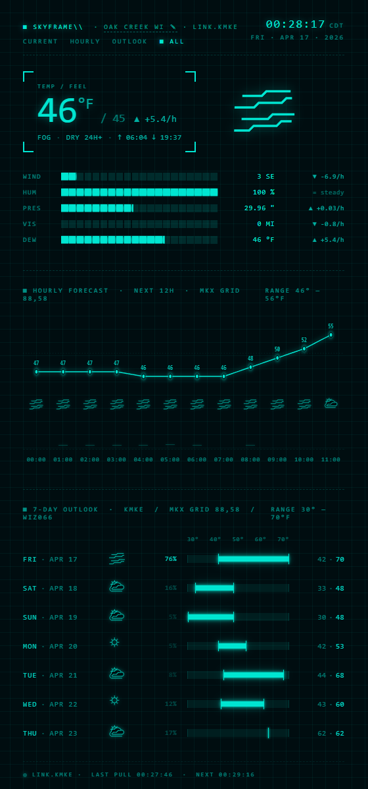

# SkyFrame

Local, ad-free weather dashboard powered by NOAA/NWS. Runs on your own computer, works for any US location, and renders a cyan-on-black HUD-style display in your browser. No API keys, no accounts, no tracking.



## Features

- **Current conditions** — temperature, wind, humidity, pressure, visibility, dewpoint with trend arrows
- **Hourly forecast** — scrollable 24-hour strip
- **7-day outlook** — daily highs/lows with condition icons
- **Weather alerts** — color-coded banners for active NWS alerts in your area
- **First-run setup** — enter a city/ZIP and email; SkyFrame auto-resolves all NWS grid metadata for you

## Requirements

- **[Node.js 20+](https://nodejs.org/)** and **npm** (npm is included with Node.js)
- A US location (NWS only covers the United States and its territories)
- A contact email (NWS requires one in the User-Agent header — it is never sent anywhere else)

## Quick start

```bash
git clone https://github.com/OniNoKen4192/SkyFrame.git
cd SkyFrame
npm install
npm run build
npm run server
```

Open **http://localhost:3000** in your browser.

On first launch you will see a setup screen. Enter your location (city name, ZIP code, or city + state) and a contact email. SkyFrame calls the NWS `/points` API to resolve your forecast office, grid coordinates, timezone, observation stations, and forecast zone automatically. The result is saved to `skyframe.config.json` (gitignored) so you only do this once.

## Usage

### Production (daily use)

```bash
npm run build    # compile the React client into dist/client
npm run server   # start Fastify on http://localhost:3000
```

Or in one shot:

```bash
npm run start:prod
```

### Development (hot reload)

```bash
npm run server   # terminal 1 — Fastify backend on :3000
npm run dev      # terminal 2 — Vite dev server on :5173 with /api proxy
```

Open **http://localhost:5173** — Vite handles the frontend with HMR; `/api` calls proxy to the backend.

### Tests

```bash
npm test           # run once
npm run test:watch # watch mode
npm run typecheck  # TypeScript check without building
```

## Configuration

All location data lives in `skyframe.config.json`, created automatically by the first-run setup. You can also configure via a `.env` file (copy `.env.example` to `.env`). The config file takes priority over `.env` values.

To reconfigure your location, delete `skyframe.config.json` and restart the server — the setup screen will reappear.

### Advanced: manual `.env` setup

If you prefer to skip the browser setup flow, copy `.env.example` to `.env` and fill in the values manually. You will need your NWS grid metadata:

```bash
curl -H "User-Agent: SkyFrame/0.1 (you@example.com)" \
  "https://api.weather.gov/points/{lat},{lon}"
```

The response contains the forecast office, grid coordinates, timezone, and forecast zone. See the comments in `.env.example` for which fields map where.

## How it works

NWS does not expose weather by ZIP code or lat/lon directly. Instead there is a two-step flow:

1. **Resolve** your lat/lon to a grid point via `/points/{lat},{lon}` (done once during setup)
2. **Fetch** forecasts, observations, and alerts using the grid-based endpoints

The Fastify backend acts as a thin local proxy: your browser calls `/api/weather`, the server calls NWS with the required `User-Agent` header (browsers forbid setting it directly), normalizes the response, and returns a single clean JSON shape. An in-memory cache prevents redundant NWS requests.

## Project structure

```
shared/types.ts  — WeatherResponse type contract (server + client)
server/          — Fastify backend, NWS proxy, cache, setup flow
client/          — React + Vite frontend (three HUD panels)
```

## Privacy

- No ads, no analytics, no telemetry
- No data leaves your machine beyond the NWS API requests themselves
- Your email is only used in the `User-Agent` header sent to NWS (their terms of service require it)
- All config stays local in `skyframe.config.json`

## License

All rights reserved. See [LICENSE](LICENSE) when published.
