# SkyFrame User's Guide

This guide walks through the dashboard from first launch to day-to-day use. If you just want to get it running, see the [Quick start in the README](../README.md#quick-start) — this document assumes the server is installed and focuses on what you see in the browser.

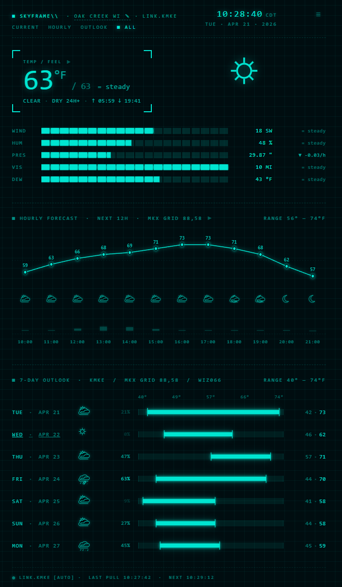

---

## 1. First launch / initial setup

The first time you open `http://localhost:3000`, SkyFrame has no idea where you are. It opens the **Settings modal** automatically with empty fields and no CANCEL button — you can't dismiss it until you provide a location and email.

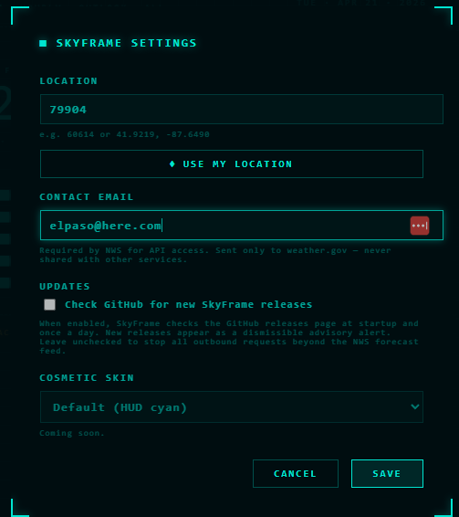

**LOCATION** — a ZIP code (`60614`) or a latitude/longitude pair (`41.9219, -87.6490`). Both work. ZIP is resolved to coordinates via a one-time call to **Nominatim** (OpenStreetMap's public geocoder) during setup; lat/lon is taken verbatim and skips that step. This is the only outbound request SkyFrame ever makes that doesn't go to NWS, and it only happens when you save Settings with a ZIP.

**◆ USE MY LOCATION** — one-click GPS autodetect. The button is only active when you're on `localhost` (browsers block Geolocation over non-HTTPS origins, so it won't work if you expose SkyFrame on a LAN). Click it, approve the browser prompt, and the LOCATION field fills with your coordinates rounded to four decimals. Review before saving.

**CONTACT EMAIL** — required by NWS in the `User-Agent` header on every API call. It's sent only to `weather.gov` and is never shared anywhere else. Use any real address you own.

**Check GitHub for new SkyFrame releases** — off by default. When enabled, SkyFrame checks the GitHub releases page once at startup and once a day at local midnight. New releases appear as a dismissible advisory-tier alert. Leaving this unchecked means SkyFrame makes zero outbound requests beyond the NWS forecast feed itself.

**COSMETIC SKIN** — placeholder for future theme options. Currently locked to Default (HUD cyan).

Click **SAVE** and SkyFrame calls the NWS `/points` API to resolve your forecast office, grid coordinates, timezone, observation stations, and forecast zone. The result is written to `skyframe.config.json` (gitignored) so you only go through this once.

You can reopen Settings anytime via the `≡` hamburger in the TopBar or by clicking your location name.

---

## 2. Dashboard anatomy

The dashboard has four regions, top to bottom:

| Region | Purpose |
|---|---|
| **TopBar** | Status line, clock, view tabs, Settings hamburger |
| **AlertBanner** | Appears above the TopBar only when active NWS alerts exist |
| **Active panel(s)** | Current, Hourly, Outlook, or all three stacked (ALL) |
| **Footer** | Station link status, pull timestamps, offline indicator |

The cyan-on-dark HUD palette is consistent across all regions. When a high-severity alert is active, the accent color shifts to match the alert tier — see [Section 5](#5-weather-alerts).

---

## 3. The TopBar

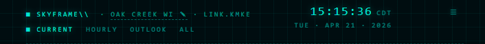

Reading left to right:

- **SKYFRAME\\** — app identifier. Purely decorative.
- **OAK CREEK WI ↘** — your configured location name. The underlined pencil arrow (`↘`) signals that clicking the text opens the Settings modal for a quick re-configure. Same as the `≡` hamburger.
- **LINK.KMKE** — the observation station currently feeding Current conditions. Goes **red** (`LINK.OFFLINE`) when the server is unreachable, and **amber** whenever the link has degraded to the secondary station — whether automatically (primary stale or returning null fields) or manually (via the Footer's station override). The Footer's `[AUTO]` vs `[PINNED]` tag tells you which one. See [Section 7](#7-the-footer).
- **Clock + date** — live-updating local time in your NWS-resolved timezone. Format: `HH:MM:SS TZ` over `DAY · MON DD · YYYY`.
- **View tabs** — `CURRENT`, `HOURLY`, `OUTLOOK`, `ALL`. Active tab has a filled square marker. Click to switch the active panel. `ALL` stacks all three.
- **≡ hamburger** — opens the Settings modal.

---

## 4. The panels

### 4.1 Current

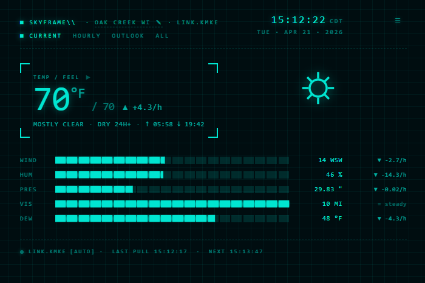

**Hero temperature** — the large number is the current temperature at your primary station. **Click it to toggle °F / °C** for the entire dashboard. The preference is saved in localStorage and persists across reloads. Server always serves °F; conversion is client-side.

**TEMP / FEEL ▶** — the small right-arrow glyph is a forecast trigger. Click it to open today's NWS narrative forecast in a modal (see [Section 6](#6-forecast-narratives)).

**Secondary readout** — `/ 70 ▲ +4.3/h` shows the apparent temperature (heat index or wind chill), a trend arrow, and the rate of change per hour. `▲` = rising, `▼` = falling, `=` = steady.

**Condition label** — short text like `MOSTLY CLEAR · DRY 24H+ · ↑ 05:58 ↓ 19:42`. First token is the current sky, second is the next-24h precip outlook, and the sunrise/sunset arrows speak for themselves.

**Metric bars** — WIND / HUM / PRES / VIS / DEW. Each bar fills proportionally to a sensible range (e.g., wind 0–40 mph, humidity 0–100%). Right side shows the raw value and a trend arrow computed from the last six observations.

**Hero icon** — the big symbol on the right side. On clear-sky conditions it centers in the hero area; otherwise it aligns right.

### 4.2 Hourly

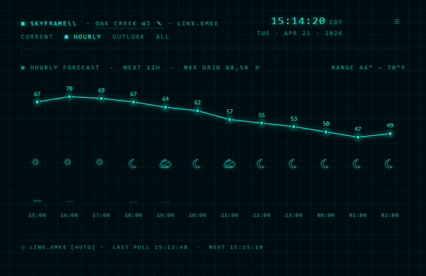

**12-hour line chart** — next twelve hours of forecast temperatures, data-point labels above each node, x-axis hours along the bottom in your local timezone.

**Icon row** — per-hour condition icon. Rain / snow / thunder icons appear when NWS precipitation probability is 30% or higher; below that they downgrade to partly-cloudy day or night to match the actual sky.

**Precip bars** — small bars along the bottom of the icon row. Taller bar = higher precip probability. No bar = zero.

**▶ forecast trigger** — next to the `HOURLY FORECAST · NEXT 12H · GRID x,y` label. Click to open today's NWS narrative.

### 4.3 Outlook

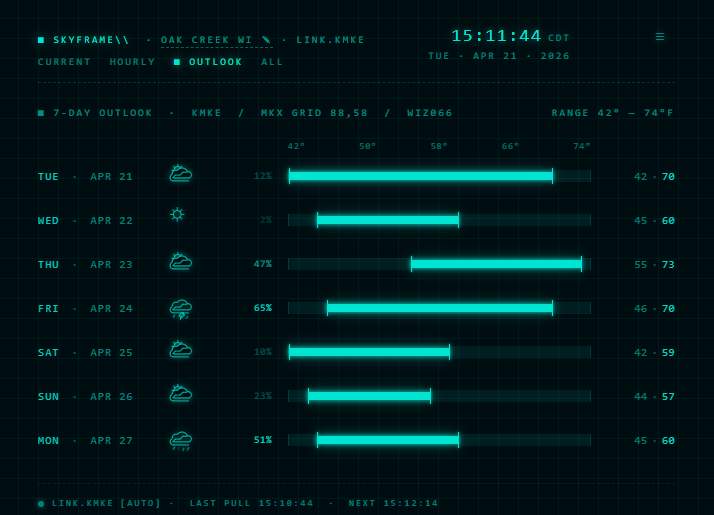

Seven-day high/low outlook in a table:

- **Day + date** — clickable. Click any day-row label to open that day's NWS narrative in a modal with `{DAY}` and `{DAY} NIGHT` sections.
- **Icon** — daily condition. Upgrades to rain/snow/thunder when precip probability is 50% or higher (picks the best match from the NWS shortForecast text).
- **Precip %** — day's precipitation probability.
- **Range bar** — visualizes the low-to-high temperature range. The numbered scale across the top (`42°`, `50°`, `58°`…) is the week's combined range; each row's bar is positioned within it.
- **Low · High** — the numeric bracket at the right.

### 4.4 ALL

The `ALL` tab stacks Current, Hourly, and Outlook in one scrollable view. Same data, same interactions — just all three panels at once. Used for the hero screenshot at the top of this guide.

---

## 5. Weather alerts

When NWS has one or more active alerts for your location, a **hazard-stripe banner** appears above the TopBar. The banner's color comes from the highest-severity alert; the rest of the dashboard accent shifts to match.

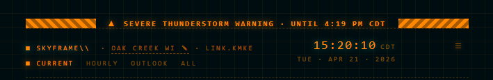

### Single alert

One alert collapses to a single-line banner showing `{SEVERITY ICON} · {EVENT NAME} · UNTIL {EXPIRY}`. The event name is clickable — it opens the detail modal.

### Multiple alerts

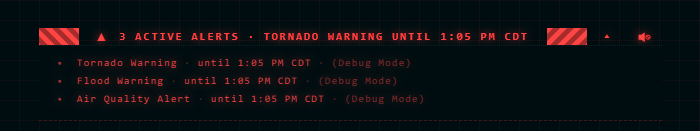

Two or more alerts show a headline row (`3 ACTIVE ALERTS · {HIGHEST-SEVERITY EVENT}`) and can expand to a stacked list. Click anywhere on the banner to toggle expand/collapse. Each event name in the expanded list is independently clickable.

### Alert detail modal

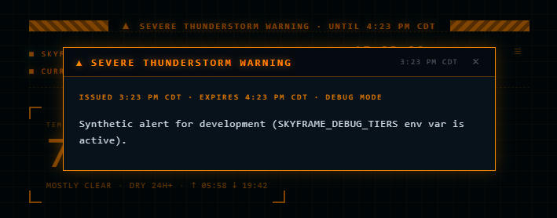

Clicking an event name opens a terminal-styled modal containing:

- **Title bar** — event name + issued timestamp
- **Meta line** — `ISSUED · EXPIRES · {AREA}` in tier color
- **Description body** — the NWS-authored text, with `HAZARD`, `SOURCE`, `IMPACT`, `PRECAUTIONARY/PREPAREDNESS ACTIONS` paragraph prefixes highlighted in the alert's tier color

Close with `×`, `Esc`, or by clicking the darkened overlay outside the modal.

### Dismissing an alert

The `×` on the right end of the banner dismisses an alert. Dismissal persists in localStorage and holds until NWS drops the alert from the active feed — when that happens, the alert is cleared from the dismissed set automatically, so if NWS re-issues it later it will appear again.

**The top five tiers cannot be dismissed.** Tornado Emergency, PDS Tornado, Tornado Warning, Destructive Severe Thunderstorm, and Severe Thunderstorm Warning render without a `×` button by design — these are life-safety alerts and staying visible is the whole point. You can still silence the audio loop via the banner's **SILENCE** button (see below), and you can still open the detail modal for the full text, but the banner itself stays up until NWS drops the alert.

### Alert sounds

Alerts at the top four tiers loop a 500 ms beep every 1.5 seconds until you click **SILENCE**. `severe-warning` plays one beep. Lower tiers are silent. All sound is synthesized via Web Audio — no files, no licenses.

The **SILENCE** button appears on the banner's right side (left of the `×` dismiss, if present) whenever an un-acknowledged repeating alert is active. Clicking it cancels all current loops and records the acknowledgment in localStorage so those alerts won't re-beep on reload. The button disappears once every looping alert has been silenced or dropped from the NWS feed. Opening the alert detail modal or toggling the multi-alert list is side-effect free — only **SILENCE** silences.

**Note:** browsers block audio playback until the tab has received a user click or keypress. If an alert arrives before you've interacted with the page, the beep is queued and plays as soon as you click anywhere. Once you've interacted, sounds play from a backgrounded tab too.

**Do not rely on SkyFrame's audio as your primary severe-weather alert.** The sounds are a redundant safety bonus on top of the visual banner, not a replacement for a NOAA Weather Radio, a phone with Wireless Emergency Alerts enabled, or another dedicated alerting system. Between browser autoplay restrictions, tabs being closed, the machine being asleep, and the general fragility of a web-based audio pipeline, there are too many ways for a beep to silently fail. Treat it as a nice-to-have, not a lifeline.

### Tier reference

Thirteen tiers, ordered by severity rank:

| Rank | Tier | Color | Example events |
|---|---|---|---|
| 1 | `tornado-emergency` | Purple `#b052e4` | Tornado Emergency, CATASTROPHIC Tornado Warning |
| 2 | `tornado-pds` | Hot magenta `#ff55c8` | CONSIDERABLE-damage Tornado Warning |
| 3 | `tornado-warning` | Red `#ff4444` | Tornado Warning |
| 4 | `tstorm-destructive` | Crimson `#ff4466` | DESTRUCTIVE Severe Thunderstorm Warning |
| 5 | `severe-warning` | Orange `#ff8800` | Severe Thunderstorm Warning |
| 6 | `blizzard` | White `#ffffff` | Blizzard Warning |
| 7 | `winter-storm` | Blue `#4488ff` | Winter Storm Warning |
| 8 | `flood` | Green `#22cc66` | Flood Warning, Flash Flood Warning |
| 9 | `heat` | Red-orange `#ff5533` | Heat Advisory, Excessive Heat Warning/Watch |
| 10 | `special-weather-statement` | Pink `#ee82ee` | Special Weather Statement |
| 11 | `watch` | Yellow `#ffdd33` | Tornado Watch, Severe Thunderstorm Watch |
| 12 | `advisory-high` | Honey `#ffaa22` | Wind / Winter Weather / Dense Fog / Wind Chill / Freeze / Frost |
| 13 | `advisory` | Cyan `#00e5d1` | Catch-all for unmapped events; also used for update notifications |

Tiers 1–11 override the dashboard accent color while visible. Tiers 12–13 show as banners but leave the dashboard accent cyan.

---

## 6. Forecast narratives

The `▶` glyph and clickable day labels open NWS's human-written forecast text in a terminal-styled modal.

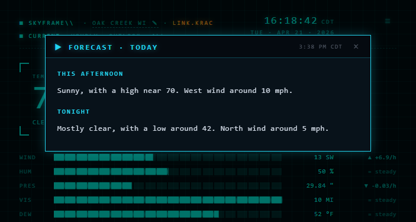

Where to find the triggers:

- **Current panel** — `▶` next to the `TEMP / FEEL` label → today's forecast
- **Hourly panel** — `▶` at the end of the `HOURLY FORECAST · NEXT 12H` label → today's forecast
- **Outlook panel** — click any day-row date (e.g. `WED · APR 22`) → that day's forecast

The modal shows day and night sections stacked vertically with the NWS-preserved period names as headers: `THIS AFTERNOON` / `TONIGHT` for today, `FRIDAY` / `FRIDAY NIGHT` for future days. If a section is missing (common for the current day when it's already late evening), the missing half is simply absent — no placeholder text.

Close with `×`, `Esc`, or overlay click. Same behavior as the alert detail modal.

---

## 7. The Footer

![Footer — green dot, LINK.KMKE [AUTO], last pull and next pull timestamps](images/footer.png)

Normal footer, left to right:

- **• LINK.KMKE [AUTO]** — live status dot + active station ID + mode tag. Green dot = online. `[AUTO]` = automatic station selection.
- **LAST PULL HH:MM:SS** — time of the most recent successful NWS fetch.
- **NEXT HH:MM:SS** — time of the scheduled next fetch (~90 seconds from last).

### Station override

The `LINK.XXXX` text is a button. Click it to open the **Station popover**.

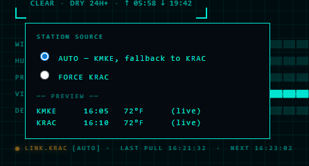

- **AUTO — KMKE, fallback to KRAC** — the default. Primary station is used unless its latest observation is older than ~90 minutes or has null core fields, in which case the secondary is used automatically.
- **FORCE KRAC** — pins the secondary station, bypassing the primary entirely. Use when the primary is online but reporting physically impossible values (e.g., during a thunderstorm).
- **`-- PREVIEW --` rows** — live side-by-side readings from both stations so you can see which one is actually reporting sane data before you override.

When FORCE is active, the Footer switches to amber:

![Footer in forced-secondary mode — amber dot, LINK.KRAC [PINNED]](images/footer-pinned.png)

The `[PINNED]` tag distinguishes manual override from automatic fallback. Both states use the same amber color because both mean "not on primary."

To return to AUTO, click `LINK.XXXX` again and select the AUTO radio.

---

## 8. The Settings modal

Reachable anytime via the `≡` hamburger in the TopBar, or by clicking your location name.

See [Section 1](#1-first-launch--initial-setup) for field explanations — the modal is the same form on first run and on later edits. Differences:

- **CANCEL** button is visible on subsequent opens (hidden on first run)
- **Current values** are pre-populated from `skyframe.config.json` via the `/api/config` endpoint
- Changing the GitHub update-check checkbox reconciles the server-side scheduler live — toggling off clears any cached update so visible update alerts disappear on the next client poll

Changes take effect without restarting the server.

---

## 9. Keyboard navigation

The dashboard's interactive elements are standard HTML buttons, so full keyboard navigation works without any custom shortcuts:

- **Tab / Shift+Tab** — move focus through interactive elements: view tabs, the hamburger, the hero temperature toggle, forecast `▶` triggers, clickable day labels in the Outlook, the Footer station button, alert banners, alert-detail links, and the `×` dismiss button.
- **Enter** or **Space** — activates the focused element. Either works.
- **Esc** — closes the currently open modal (Settings, alert detail, or forecast narrative). Clicking the darkened overlay outside the modal is equivalent.

Focus returns to the element that opened the modal on close, so keyboard users don't lose their place. While any modal is open, Tab and Shift+Tab cycle within the modal — focus can't escape to the TopBar, panels, or Footer until you close it.

---

## 10. Troubleshooting

### "Screen is offline / LINK.OFFLINE red dot"

![TopBar shows red LINK.OFFLINE, footer shows red dot and LINK.OFFLINE [AUTO]](images/offline-indicator.png)

The client can't reach the SkyFrame server, or the server can't reach NWS. Checks, in order:

1. Is the Node server still running? (Check the terminal you started `npm run server` in.)
2. Can you open `http://localhost:3000/api/weather` directly? If it returns JSON, the server is fine and the client will recover on the next poll.
3. Is your machine online? Try `https://api.weather.gov` in another tab.
4. Rare: NWS itself is down. Their outages are usually minutes, not hours. Wait and the indicator clears on the next successful pull.

### "SKYFRAME\\ BOOTSTRAP FAILED screen"

The client loaded but couldn't reach the server at all — the `/api/config` request failed. This usually means the Node server isn't running (terminal closed, process crashed). Start the server with `npm run server` and click **RETRY** on the panel. If the retry also fails, check the server terminal for errors.

### "Data looks stuck / old timestamp"

Two possibilities:

- **Primary station is stale.** The normal 90-minute staleness check should have already moved you to the secondary automatically — check the Footer for `LINK.XXXX [AUTO]` where `XXXX` is your secondary station. If you're still on primary, the staleness threshold hasn't triggered yet.
- **Cache holding the last response.** The server caches for 90 seconds; if you just restarted the server, the first request after restart forces a fresh fetch.

### "Readings are physically impossible" (0°F in July, 100 mph wind with clear skies, etc.)

The primary station is likely damaged but still reporting. The automatic staleness check only triggers on *age* or *null fields* — it can't detect nonsense values. Open the station popover from the Footer's `LINK.XXXX` button and switch to FORCE SECONDARY. Check the live preview rows first to confirm the secondary has sane readings.

### "No sound for alert"

Browsers block `AudioContext` playback until the tab has received a user click or keypress. If an alert arrives before you've interacted with the page, the alert is visible but silent. Click anywhere on the page once and audio is unlocked for the rest of the session (including backgrounded tabs). This is a browser restriction, not a SkyFrame bug.

### "NWS API rate-limited"

NWS rate-limits per User-Agent. SkyFrame caches for 90 seconds and batches its five endpoint fetches together, so normal single-user operation stays well under any sane limit. If you see rate-limit errors:

- Check you're not running multiple SkyFrame instances against the same User-Agent simultaneously.
- Wait 90 seconds — the cache serves the last-known-good response even while upstream is throttled.
- Confirm your `CONTACT_EMAIL` in Settings is a real email. NWS specifically flags generic or missing contact headers.

---

## Further reading

- [README](../README.md) — install, quick start, architecture overview
- [PROJECT_SPEC.md](../PROJECT_SPEC.md) — product requirements and design intent
- [WEATHER_PROVIDER_RESEARCH.md](../WEATHER_PROVIDER_RESEARCH.md) — why NOAA/NWS and not a paid provider
- [PROJECT_STATUS.md](../PROJECT_STATUS.md) — current feature list and release history
